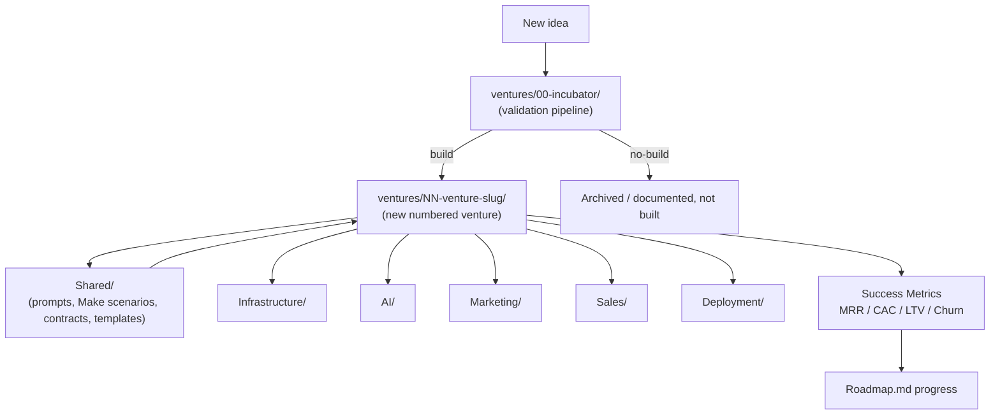

# ABOS Architecture

How the pieces of the AI Business Operating System fit together — from a raw idea to a running, semi-autonomous venture.

## Table of Contents

- [System Diagram](#system-diagram)
- [Incubator Pipeline](#incubator-pipeline)
- [Venture Folder Anatomy](#venture-folder-anatomy)
- [Shared vs. Per-Venture](#shared-vs-per-venture)
- [Agent Context Files](#agent-context-files)
- [Data & Decision Flow](#data--decision-flow)

## System Diagram



## Incubator Pipeline

Every new venture idea enters through [`ventures/00-incubator/`](ventures/00-incubator/README.md) and passes through the same fifteen stages, split into two phases:

**Phase A — Incubator** (lives entirely inside `ventures/00-incubator/`, ends in a decision):

1. Opportunity research
2. Fast-fail gate — [`IdeaValidationChecklist.md`](ventures/00-incubator/IdeaValidationChecklist.md)
3. Market validation — [`MarketResearchTemplate.md`](ventures/00-incubator/MarketResearchTemplate.md)
4. Competitor analysis
5. Pricing
6. MVP definition
7. Technical architecture
8. AI automation opportunities
9. Marketing strategy
10. Financial projections
11. Score & decide — [`BusinessScorecard.md`](ventures/00-incubator/BusinessScorecard.md) → Build / Revisit / Reject

**Phase B — Post-Incubator** (only for ideas scored **Build**, lives in `ventures/NN-venture-slug/`):

12. Build
13. Launch — [`LaunchChecklist.md`](ventures/00-incubator/LaunchChecklist.md)
14. Scale
15. Archive or expand

The fast-fail gate (stage 2) exists separately from scoring (stage 11) on purpose: it kills obviously-bad ideas cheaply before any research time is spent, while the scorecard makes the final call once real research is in hand. Stages 3–10 are not shortcuts — pricing, financial projections, and market validation should be backed by actual research (competitor pricing, market sizing, churn/CAC benchmarks), not assumed numbers.

Only ideas that clear stage 11 with a **build** decision get promoted to `ventures/NN-venture-slug/`. Ideas that don't clear the bar stay documented inside the incubator as a record of what was considered and why it was rejected — this prevents re-litigating the same idea twice. See [`ventures/00-incubator/README.md`](ventures/00-incubator/README.md) for how ideas are tracked per-idea within the folder.

## Venture Folder Anatomy

Once promoted, every venture folder follows the same deep structure — organized like a real software company's internal docs, not a flat pile of files — so that context-switching between ventures (and handing context to Claude or ChatGPT) is predictable:

```
ventures/NN-venture-slug/
├── README.md              # Short human-facing index — what's here, where to look
├── CLAUDE.md              # Context + coding instructions for Claude Code
├── GPT.md                 # Prompts/instructions for ChatGPT / Codex
├── PROJECT_CONTEXT.md     # Architecture and conventions specific to this venture
├── DECISIONS.md           # Architectural decisions and rationale (decision log)
├── CHANGELOG.md           # Chronological log of what shipped, in order
│
├── docs/                  # BUSINESS_PLAN.md and other overview/strategy docs
├── research/              # MARKET_RESEARCH.md (the flagship, gold-standard doc — see DevelopmentStandards.md) and other sources backing docs/
├── architecture/          # Technical architecture, system design, service boundaries
├── database/              # Schema, ER diagrams, migrations strategy, seed data
├── api/                   # API contracts and endpoint specs
├── automation/            # Make.com / n8n workflow specs
├── src/                   # Actual application source code — see note below
├── prompts/               # Versioned prompt library (one file per prompt, with eval notes)
├── deployment/             # CI/CD, hosting, environments
├── marketing/               # Marketing engine: channels, content strategy, SEO
├── sales/                   # Sales engine: funnel, onboarding, upgrade paths
├── finance/                  # Financial model, unit economics, projections
├── legal/                     # Contracts, ToS, privacy policy specific to this venture
├── tasks/                     # TASKS.md and any copied checklists (e.g. LaunchChecklist.md)
└── diagrams/                   # Standalone diagram assets, if a diagram doesn't fit inline
```

The six root-level files (`README.md`, `CLAUDE.md`, `GPT.md`, `PROJECT_CONTEXT.md`, `DECISIONS.md`, `CHANGELOG.md`) stay at the venture's top level, not nested in a subfolder — an agent (or Ryan) opening the folder needs to find them immediately without digging. `README.md` and `PROJECT_CONTEXT.md` have distinct, non-overlapping jobs: `README.md` is a short human-facing tour of the folder (what's here, where to look — same role the incubator's own `README.md` plays); `PROJECT_CONTEXT.md` is the longer AI-agent context primer (scope, constraints, current stage). Everything else is organized by function into its subfolder.

This is the minimum set. Individual ventures can add more docs or subfolders as needed, but should not remove any of the above without a note in that venture's own `DECISIONS.md`.

**`src/` vs. `api/`/`automation/`:** `api/` and `automation/` hold *specs* — contracts and workflow descriptions, written before or alongside a build. `src/` holds the actual runnable source code once a venture starts building for real (added when `ventures/02-automation-studio` needed a home for real Azure Function / Teams bot code and none of the existing folders fit — see its `DECISIONS.md`). Keep specs and code in sync by linking between them, not by duplicating content.

Depth matters here: a subfolder like `architecture/` or `database/` is expected to hold real, researched documentation once a venture is actively being built — enough that a senior engineer who has never spoken to Ryan could read it and start implementing confidently, not a bullet-point stub.

### Document Dependency Chain

Flagship documents within a venture build on each other in a specific order — each one should cite the documents before it rather than re-deriving or duplicating their conclusions:

```
research/MARKET_RESEARCH.md   (gold standard — demand, competitors, pricing evidence)
        ↓
docs/BUSINESS_PLAN.md          (business decisions, cited against the research above)
        ↓
PROJECT_CONTEXT.md             (scope, constraints, principles — once we know what we're building)
        ↓
architecture/TECHNICAL_ARCHITECTURE.md   (technology choices, justified rather than assumed)
        ↓
database/, api/, automation/, prompts/    (implementation-level specs)
```

`MARKET_RESEARCH.md` is deliberately first and is the gold-standard document for the whole venture: its job isn't to decide what to build, it's to establish whether there's real demand, who pays, how much, and what competitors are missing — with evidence, not assumptions. Every downstream document should be easier and more reliable to write because it's citing researched fact rather than guessing. See [`ventures/01-lead-engine/research/MARKET_RESEARCH.md`](ventures/01-lead-engine/research/MARKET_RESEARCH.md) once it's rebuilt to this standard, and [DevelopmentStandards.md § File & Folder Naming](DevelopmentStandards.md#file--folder-naming) for why flagship docs use `SCREAMING_SNAKE_CASE`.

## Shared vs. Per-Venture

A component belongs in root-level `Shared/` (or one of the other root folders) instead of inside a venture folder when **at least two ventures use it, or it's expected to be reused.** Otherwise it stays local to the venture.

| Root Folder | Contains |
|---|---|
| `Shared/Prompt-Library/` | General-purpose prompts not tied to one venture |
| `Shared/Make-Scenarios/` | Reusable Make.com automation scenarios |
| `Shared/Claude-Prompts/` / `Shared/ChatGPT-Prompts/` | Model-specific prompt packs |
| `Shared/Email-Templates/` | Transactional/marketing email templates |
| `Shared/Contracts/` | Legal/contract templates |
| `Infrastructure/` | Cross-venture hosting, DNS, secrets management notes |
| `AI/` | Model usage notes, agent configs, eval logs |
| `Marketing/` | Cross-venture marketing playbooks and strategy |
| `Sales/` | Cross-venture sales playbooks and strategy |
| `Deployment/` | CI/CD and release process documentation |
| `Templates/` | Blank scaffolds for new ventures (mirrors the anatomy above) |
| `Resources/` | Reference material, research, swipe files |

When something starts as venture-specific and later proves reusable, promote it: move it to the matching `Shared/` (or root) folder and leave a one-line pointer in the original venture's `DECISIONS.md`.

## Agent Context Files

Every venture's `CLAUDE.md` and `GPT.md` should be self-contained enough that opening just that folder (without the rest of the repo) gives an AI agent enough context to produce work consistent with the rest of ABOS. They should reference, not duplicate, the root-level standards:

- Link to [DevelopmentStandards.md](DevelopmentStandards.md) rather than restating conventions
- Link to relevant `Shared/` assets rather than copying prompt text inline
- Keep venture-specific context (domain, target customer, current priorities) local to that venture's files

## Data & Decision Flow

1. Idea enters the incubator → validation stages produce a written record at each step.
2. Build decision promotes the idea to a numbered venture folder, scaffolded from `Templates/` using the deep taxonomy above.
3. The venture pulls reusable assets from `Shared/` and the other root folders as needed.
4. As the venture operates, its success metrics (MRR, CAC, LTV, churn, automation %) roll up to track progress against [Roadmap.md](Roadmap.md) targets.
5. Anything built for one venture that turns out to be broadly useful gets promoted into a shared/root folder for the next venture to reuse.
