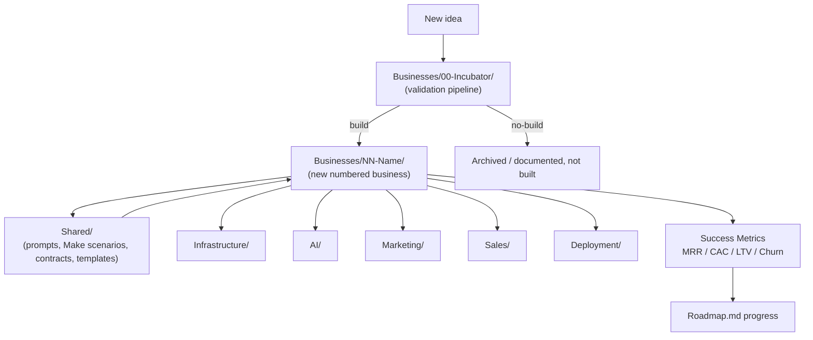

# ABOS Architecture

How the pieces of the AI Business Operating System fit together — from a raw idea to a running, semi-autonomous business.

## Table of Contents

- [System Diagram](#system-diagram)
- [Incubator Pipeline](#incubator-pipeline)
- [Business Folder Anatomy](#business-folder-anatomy)
- [Shared vs. Per-Business](#shared-vs-per-business)
- [Agent Context Files](#agent-context-files)
- [Data & Decision Flow](#data--decision-flow)

## System Diagram



## Incubator Pipeline

Every new business idea enters through `Businesses/00-Incubator/` and passes through the same ten stages before it earns its own numbered folder:

1. Opportunity research
2. Market validation
3. Competitor analysis
4. Pricing
5. MVP definition
6. Technical architecture
7. AI automation opportunities
8. Marketing strategy
9. Financial projections
10. Build/no-build decision

Only ideas that clear stage 10 with a **build** decision get promoted to `Businesses/NN-Business-Name/`. Ideas that don't clear the bar stay documented inside the incubator as a record of what was considered and why it was rejected — this prevents re-litigating the same idea twice.

## Business Folder Anatomy

Once promoted, every business folder follows the same internal shape so that context-switching between businesses (and handing context to Claude or ChatGPT) is predictable:

```
Businesses/NN-Business-Name/
├── CLAUDE.md              # Context + coding instructions for Claude Code
├── GPT.md                 # Prompts/instructions for ChatGPT / Codex
├── PROJECT_CONTEXT.md     # Architecture and conventions specific to this business
├── TASKS.md               # Prioritized implementation backlog
├── DECISIONS.md           # Architectural decisions and rationale (decision log)
├── BusinessPlan.md
├── Architecture.md
├── Database.md
├── API.md
└── PromptLibrary.md
```

This is the minimum set. Individual businesses can add more docs as needed, but should not remove any of the above without a note in that business's own `DECISIONS.md`.

## Shared vs. Per-Business

A component belongs in root-level `Shared/` (or one of the other root folders) instead of inside a business folder when **at least two businesses use it, or it's expected to be reused.** Otherwise it stays local to the business.

| Root Folder | Contains |
|---|---|
| `Shared/Prompt-Library/` | General-purpose prompts not tied to one business |
| `Shared/Make-Scenarios/` | Reusable Make.com automation scenarios |
| `Shared/Claude-Prompts/` / `Shared/ChatGPT-Prompts/` | Model-specific prompt packs |
| `Shared/Email-Templates/` | Transactional/marketing email templates |
| `Shared/Contracts/` | Legal/contract templates |
| `Infrastructure/` | Cross-business hosting, DNS, secrets management notes |
| `AI/` | Model usage notes, agent configs, eval logs |
| `Marketing/` | Cross-business marketing playbooks and strategy |
| `Sales/` | Cross-business sales playbooks and strategy |
| `Deployment/` | CI/CD and release process documentation |
| `Templates/` | Blank scaffolds for new businesses (mirrors the anatomy above) |
| `Resources/` | Reference material, research, swipe files |

When something starts as business-specific and later proves reusable, promote it: move it to the matching `Shared/` (or root) folder and leave a one-line pointer in the original business's `DECISIONS.md`.

## Agent Context Files

Every business's `CLAUDE.md` and `GPT.md` should be self-contained enough that opening just that folder (without the rest of the repo) gives an AI agent enough context to produce work consistent with the rest of ABOS. They should reference, not duplicate, the root-level standards:

- Link to [DevelopmentStandards.md](DevelopmentStandards.md) rather than restating conventions
- Link to relevant `Shared/` assets rather than copying prompt text inline
- Keep business-specific context (domain, target customer, current priorities) local to that business's files

## Data & Decision Flow

1. Idea enters the incubator → validation stages produce a written record at each step.
2. Build decision promotes the idea to a numbered business folder, scaffolded from `Templates/`.
3. The business pulls reusable assets from `Shared/` and the other root folders as needed.
4. As the business operates, its success metrics (MRR, CAC, LTV, churn, automation %) roll up to track progress against [Roadmap.md](Roadmap.md) targets.
5. Anything built for one business that turns out to be broadly useful gets promoted into a shared/root folder for the next business to reuse.
