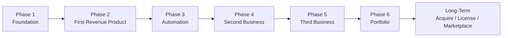

# AI Business Operating System — Multi-Year Roadmap

## Table of Contents

- [Phase Overview](#phase-overview)
- [Phase 1 — Foundation](#phase-1--foundation)
- [Phase 2 — First Revenue Product](#phase-2--first-revenue-product)
- [Phase 3 — Automation](#phase-3--automation)
- [Phase 4 — Second Business](#phase-4--second-business)
- [Phase 5 — Third Business](#phase-5--third-business)
- [Phase 6 — Portfolio](#phase-6--portfolio)
- [Long-Term](#long-term)
- [Repo Version ↔ Phase Mapping](#repo-version--phase-mapping)

## Phase Overview

Note: Phase 4 onward is not a hard cap at three businesses — see [Long-Term](#long-term). Once the portfolio phase is reached, new businesses are added continuously rather than treated as discrete numbered phases.

## Phase 1 — Foundation

**Duration:** 2 weeks

**Objectives**
- ✅ Repository structure
- ⬜ Shared components
- ⬜ Documentation
- ⬜ Development standards
- ⬜ Deployment pipeline

**Deliverables**
- [x] README.md
- [x] Roadmap.md
- [ ] Shared Prompt Library
- [ ] Make Scenarios
- [ ] Claude Prompt Packs

## Phase 2 — First Revenue Product

**Duration:** 60 days

**Goal:** Launch first AI SaaS product (business emerges from `Businesses/00-Incubator/` after passing the validation pipeline — see [Architecture.md](Architecture.md#incubator-pipeline))

**Target:** $1,000 MRR

## Phase 3 — Automation

Every repetitive task in the first business gets automated:

- Marketing
- Sales
- Support
- Billing
- Reporting
- Deployments
- Analytics

## Phase 4 — Second Business

Launch second SaaS product, reusing shared components from Phase 1 and lessons from Phase 3.

**Target:** $3,000 MRR (combined)

## Phase 5 — Third Business

**Target:** $5,000 MRR (combined)

## Phase 6 — Portfolio

Operate multiple businesses simultaneously; shared infrastructure and playbooks carry most of the operational load.

**Target:** $10,000+/month (combined)

## Long-Term

Beyond the numbered phases, ABOS is treated as a living system rather than a fixed five-business plan:

- Continue adding new businesses as `Businesses/06-...`, `07-...`, etc.
- Acquire existing small businesses and bring them under the same operating model
- Build reusable AI agents that can be deployed across businesses
- Create a marketplace for shared components (prompts, automations, templates)
- License ABOS technology/components to others

## Repo Version ↔ Phase Mapping

| Repo Version | Corresponds To |
|---|---|
| 0.1 | Repository Foundation (Phase 1 start) |
| 0.2 | Shared Components (Phase 1 completion) |
| 0.3 | Business #1 scaffolded (Phase 2 start) |
| 0.4 | Business #2 scaffolded (Phase 4 start) |
| ... | ... |
| 1.0 | Launch Ready |

See [README.md](README.md#versioning) for the versioning philosophy.
