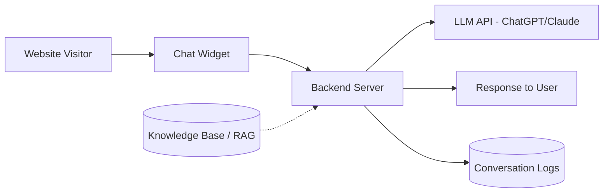

# Idea: AI-Powered Chatbot (Customer Support & Lead Gen)

**Incubator stage:** 3–10 (market validation, not yet scored). One of five options evaluated in parallel — see [`Ideas/README.md`](../README.md). Note the overlap with [`ventures/01-lead-engine/`](../../../01-lead-engine/) — that venture's AI qualification layer is functionally a specialized version of this idea, scoped to one vertical.

## Table of Contents

- [Summary](#summary)
- [Business Model & Pricing](#business-model--pricing)
- [Target Customer](#target-customer)
- [Technical Architecture](#technical-architecture)
- [Implementation Plan](#implementation-plan)
- [Costs & Revenue](#costs--revenue)
- [Risks](#risks)
- [Legal & Compliance](#legal--compliance)
- [MVP Feature List](#mvp-feature-list)
- [Go / No-Go Read](#go--no-go-read)
- [Sources](#sources)

## Summary

Build and deploy AI chatbots (website widget or messaging-channel integration) for small/mid-size businesses — answering FAQs, qualifying leads, deflecting routine support tickets. Setup fee + monthly subscription model. The most technically demanding of the five options, but the one that most directly uses real software-development skill (backend, retrieval, integration) rather than prompt/workflow assembly alone.

## Business Model & Pricing

Setup fee $1,000–3,000 + monthly $200–500 for maintenance/hosting/LLM costs, tiered by traffic volume — consistent with the original draft's pricing and with what real deflection economics can support (see below).

## Target Customer

Mid-market e-commerce, SaaS vendors, and professional services (legal, finance) needing 24/7 first-line response. Requires higher-consideration, higher-budget clients than the social-media or SEO options — fewer clients needed, but a longer, more consultative sales cycle.

## Technical Architecture

Requires retrieval-augmented generation (RAG) against client-specific data for accuracy — this is real backend engineering, not just prompt chaining, which is both the differentiator and the reason build time is longest of the five.

## Implementation Plan

Realistic MVP: 6–10 weeks — backend + LLM integration, RAG/knowledge-base setup, widget frontend, fallback/escalation logic, pilot with one client. Longest build of the five options, but the deliverable itself is closer to a real software product, which compounds better (each client is a variant of the same core system, not a from-scratch service engagement).

## Costs & Revenue

**Recurring costs:** ~$200–300/month per active deployment (hosting, LLM API costs scale with query volume — this is the one option where per-client variable cost matters).

**Revenue reality, grounded in research:**

- Median tier-1 ticket deflection across real enterprise deployments is **41.2%** — not the 70–90% vendors advertise, which reflects only the best-case intent mix ([source](https://www.eesel.ai/blog/deflection-rate-what-is-it-and-how-to-improve-it)). High-structure intents with a clear backend system of record (order status, refunds) deflect 65–80%; open-ended support does not.
- Industry-average ROI is **$3.50 returned per $1 invested**, with realistic net cost reduction of **20–35% in year one** after infrastructure spend — not the "40–70% reduction" figure in the original draft, which overstates typical (vs. best-case) outcomes ([source](https://www.digitalapplied.com/blog/ai-customer-support-statistics-2026-adoption-roi-data)).
- Small businesses using off-the-shelf chatbots report payback in **3–5 months**; mid-market with custom integration, **6–9 months** ([source](https://www.solvara.tech/blog/ai-chatbot-2026-roi-breakdown)).

**Read:** 3–4 clients at $1,500–2,000/mo effective (setup amortized + subscription) reaches $6K/mo, consistent with the original draft — but the sales pitch needs to lead with realistic 20–35% cost reduction and 3–6 month payback, not inflated deflection numbers, or credibility breaks on the first serious prospect who's done their own research.

## Risks

- **Hallucination/accuracy risk carries real cost** — a wrong answer from a chatbot is a worse failure mode than a wrong newsletter summary; needs RAG grounding and conservative fallback behavior ("let me get a human"), not open-ended generation.
- Longer, more consultative sales cycle than the other options — fewer, larger deals means more revenue concentration risk per client lost.
- Vendor lock-in to one LLM provider without a modular backend.
- Client expectation-setting: needs explicit communication that this deflects routine queries, not all support.

## Legal & Compliance

Disclaimers if operating anywhere near legal/medical advice categories. Some jurisdictions require disclosure that a user is chatting with an AI. Data handling for any PII passed through conversations — encryption in transit, minimal retention, GDPR/CCPA data-deletion support if serving those regions.

## MVP Feature List

- Embeddable chat widget
- RAG-grounded LLM backend against client knowledge base
- Fallback/escalation to human path
- Admin dashboard: conversation logs, deflection rate, lead capture

## Go / No-Go Read

Highest revenue-per-client and the strongest match to genuine software-engineering skill of the five options, but also the longest build and most consultative sale. Good complement to (not necessarily a replacement for) a faster-revenue option — the RAG/backend work here is largely reusable for [`ventures/01-lead-engine/`](../../../01-lead-engine/)'s AI qualification layer, so building this skillset serves both.

## Sources

- [Deflection rate in AI support: what it is and how to improve it (2026)](https://www.eesel.ai/blog/deflection-rate-what-is-it-and-how-to-improve-it)
- [AI Customer Support 2026: 50+ Adoption + ROI Data Points](https://www.digitalapplied.com/blog/ai-customer-support-statistics-2026-adoption-roi-data)
- [How Much Can an AI Chatbot Actually Save Your Business? A 2026 ROI Breakdown](https://www.solvara.tech/blog/ai-chatbot-2026-roi-breakdown)
