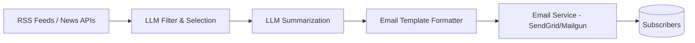

# Idea: AI-Driven Niche Newsletter (Subscription)

**Incubator stage:** 3–10 (market validation, not yet scored). One of five options evaluated in parallel — see [`Ideas/README.md`](../README.md) for the comparison and how this relates to [`ventures/01-lead-engine/`](../../../01-lead-engine/).

## Table of Contents

- [Summary](#summary)
- [Business Model & Pricing](#business-model--pricing)
- [Target Customer](#target-customer)
- [Technical Architecture](#technical-architecture)
- [Implementation Plan](#implementation-plan)
- [Costs & Revenue](#costs--revenue)
- [Risks](#risks)
- [Legal & Compliance](#legal--compliance)
- [MVP Feature List](#mvp-feature-list)
- [Go / No-Go Read](#go--no-go-read)
- [Sources](#sources)

## Summary

A fully automated curated newsletter in a specialized niche: an LLM pipeline (orchestrated via Make.com or n8n) ingests RSS/news sources, filters and summarizes the top stories, formats them, and sends on a schedule. Revenue is subscription-based. Minimal ongoing labor once the pipeline is tuned — the closest of the five options to "set it and forget it," but also the slowest to meaningful revenue.

## Business Model & Pricing

Tiered subscription: free weekly digest as a funnel, paid daily/premium tier ($5–20/mo). Founding-member annual discounts to seed initial subscribers.

## Target Customer

Professionals/enthusiasts in a specific niche who want curated signal without reading 20 sources themselves (AI research, fintech, health tech, etc.) — B2C, high volume needed, low price point.

## Technical Architecture

Straightforward for a developer: RSS/API ingestion → LLM summarization via Make.com/n8n → email delivery (SendGrid/Mailgun or Substack/Ghost) → landing page + Stripe for paid tiers.

## Implementation Plan

Realistic MVP: 2–4 weeks part-time (source ingestion, prompt tuning, email delivery, landing page). Fastest path to a working pipeline of the five options — the bottleneck isn't build time, it's the 18–24 months typically required to reach meaningful subscriber counts (see [Costs & Revenue](#costs--revenue)).

## Costs & Revenue

**Recurring costs:** ~$50–100/month (hosting, Make.com/n8n, LLM API, email service) — the cheapest of the five options to run.

**Revenue reality, grounded in research rather than the vague "reached ~10,000 subscribers" claim in the original ChatGPT draft of this idea:**

- One documented solo-creator case: zero to 47,000+ readers and **$6,400/month** using AI automation, no manual writing ([source](https://medium.com/@bhallaanuj69/i-built-a-10k-month-ai-newsletter-in-14-days-complete-blueprint-revenue-proof-a5942ae744fe) — self-reported, treat as an upper-bound anecdote, not a typical outcome).
- Broader benchmark: **top 5%** of newsletter creators reach $184K/year (10,000–20,000 subscribers, $15–20K/month) — and it takes most of them **18–24 months** to get there ([source](https://ritz7.ai/blog/monetize-n8n-automation-skills/)).
- A separate automation case study (GPT-4 + DALL·E + n8n) scaled an existing newsletter to 80,000+ readers with 70% lower operational cost, but started from an already-running publication, not zero ([source](https://arnasoftech.com/case-study/ai-newsletter-automation/)).

**Read:** the *automation* works reliably — every source confirms that. The *revenue timeline* is the risk: hitting $4K+/month from this alone realistically takes over a year of consistent growth, not months, unless starting from an existing audience.

## Risks

- **Slowest revenue ramp of the five options** — 18–24 months to top-tier revenue is the norm, not the exception, per research above.
- Content quality/genericness — AI summaries can read as generic; needs real prompt engineering and occasional human review to avoid churn.
- Platform/API cost or policy changes (OpenAI/Anthropic pricing shifts).
- "AI slop" perception risk if audience senses fully automated content with no editorial judgment.

## Legal & Compliance

CAN-SPAM/GDPR compliance for email (opt-in, unsubscribe links). Respect source content copyright — summarize under fair use, credit sources, avoid full-text reproduction (directly relevant given [the repo's own copyright constraints](../../../../DevelopmentStandards.md)).

## MVP Feature List

- Automated content ingestion + filtering
- AI summarization + formatting
- Subscriber signup + Stripe billing
- Scheduled send
- Basic open/click analytics

## Go / No-Go Read

Genuinely low-effort to automate, cheapest to run — but weakest fit for the **specific goal of $4K→$10K/month within a reasonable timeframe**, since the revenue curve is long. Best treated as a low-cost, low-maintenance side bet layered under a faster-revenue option (e.g. cross-promote from [`ai-seo-content-agency`](../ai-seo-content-agency/MarketResearch.md) or [`automation-reselling`](../automation-reselling/MarketResearch.md)), not the primary vehicle.

## Sources

- [I Built a $10K/Month AI Newsletter in 14 Days](https://medium.com/@bhallaanuj69/i-built-a-10k-month-ai-newsletter-in-14-days-complete-blueprint-revenue-proof-a5942ae744fe)
- [How to Make Money with n8n: 5 Proven Strategies](https://ritz7.ai/blog/monetize-n8n-automation-skills/)
- [Automate AI Newsletter Publishing with GPT-4 & n8n — Case Study](https://arnasoftech.com/case-study/ai-newsletter-automation/)
- [6 Ways an AI Newsletter Makes Money. Two Scale, Four Stall.](https://medium.com/@automation.labs/6-ways-an-ai-newsletter-makes-money-two-scale-four-stall-b7ae05c3ac61)
