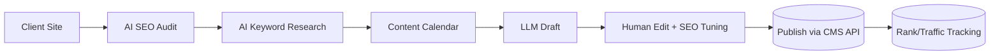

# Idea: AI-Enhanced SEO & Content Optimization Agency

**Incubator stage:** 3–10 (market validation, not yet scored). One of five options evaluated in parallel — see [`Ideas/README.md`](../README.md).

## Table of Contents

- [Summary](#summary)
- [Business Model & Pricing](#business-model--pricing)
- [Target Customer](#target-customer)
- [Technical Architecture](#technical-architecture)
- [Implementation Plan](#implementation-plan)
- [Costs & Revenue](#costs--revenue)
- [Risks](#risks)
- [Legal & Compliance](#legal--compliance)
- [MVP Feature List](#mvp-feature-list)
- [Go / No-Go Read](#go--no-go-read)
- [Sources](#sources)

## Summary

AI-augmented SEO/content retainer service: automated keyword research, AI-drafted (human-edited) blog content, on-page optimization, and monthly reporting. Positioned as faster turnaround and lower cost than a traditional agency, using AI to compress the labor that normally makes SEO retainers expensive.

## Business Model & Pricing

Real 2026 pricing is **notably higher** than the original draft's $800–1,500/mo estimate:

- Small businesses typically budget **$2,500–5,000/month** for comprehensive SEO ([source](https://infinenetech.com/blog/ai-seo-packages-pricing-2026)).
- Lower-end small-business packages run **$1,500–3,000/month**; below $2,500, agencies struggle to cover multi-platform AI optimization comprehensively ([source](https://www.stackmatix.com/blog/ai-seo-services-pricing-cost-guide)).
- Market distribution: 48% of agencies price $1,500–5,000/mo, another 43% under $1,500/mo — a genuine low-end lane exists for a lean, AI-native operator.
- A newer, separately billed line item: **GEO/AEO** (optimizing visibility inside ChatGPT, Perplexity, Google AI Overviews) — 37% of agencies that raised prices in 2025–26 cited this, often $900+/mo add-on ([source](https://www.stackmatix.com/blog/ai-seo-agency-pricing)). This is a genuine differentiation opportunity for someone who already understands how LLMs retrieve and cite content.

**Read:** the original draft undersold this — a realistic entry price is closer to $1,200–2,500/mo than $800–1,500/mo, meaning **fewer clients are needed** to hit $6K/month (3–5 vs. 6).

## Target Customer

Small-to-mid businesses with web presence but no in-house SEO expertise — B2B services, local businesses, e-commerce. Same overlap consideration as the social-media option: local-service businesses intersect with [`ventures/01-lead-engine/`](../../../01-lead-engine/)'s ICP.

## Technical Architecture

## Implementation Plan

Realistic MVP: 4–6 weeks (audit automation, content workflow, CMS publishing integration, reporting dashboard). Faster than the chatbot option, comparable to the social-media option.

## Costs & Revenue

**Recurring costs:** ~$150–250/month (LLM API, SEO tool subscriptions like Frase/Ahrefs, hosting).

**Revenue math (corrected):** 3–5 clients at $1,200–2,500/mo reaches $4,000–10,000/mo — a notably better ratio than the original draft's "6 clients at $1,000/mo," because real market pricing sits higher. SEO retainers also tend to have longer client tenure (6+ months) than social-media retainers, once results show, giving more revenue stability.

## Risks

- **Results lag reality is real and needs explicit client expectations** — SEO gains take 3–6 months minimum to show; over-promising kills renewals.
- Search-engine penalties for low-quality/duplicate AI content — genuinely dangerous if AI drafts are published unedited; human editing is not optional here.
- Google algorithm volatility affects outcomes outside the operator's control.
- Increasingly saturated "AI SEO agency" positioning — differentiation (e.g. leaning into GEO/AEO, a newer and less commoditized niche) matters more than in 2024–25.

## Legal & Compliance

Plagiarism/duplicate-content risk even from AI-generated drafts trained on similar sources — run through plagiarism checkers before publishing. Standard data-privacy handling if scraping client site/analytics data.

## MVP Feature List

- Automated SEO audit report
- AI-assisted content calendar + drafting (human-edited before publish)
- On-page optimization suggestions (meta, headers)
- Analytics integration (GA4/Search Console) + monthly client report

## Go / No-Go Read

Best-corrected economics of the five options once real pricing is used instead of the original draft's undersold estimate — fewer clients needed to hit the target range, faster build than the chatbot option, and a genuine differentiation angle (GEO/AEO) that rewards understanding how LLMs actually retrieve content, which is a real technical edge for a developer over a typical marketing-agency operator.

## Sources

- [AI SEO Packages Pricing 2026: What US Businesses Should Pay](https://infinenetech.com/blog/ai-seo-packages-pricing-2026)
- [AI SEO Services Pricing and Cost Guide 2026](https://www.stackmatix.com/blog/ai-seo-services-pricing-cost-guide)
- [AI SEO Agency Pricing: Complete Cost Guide for 2026](https://www.stackmatix.com/blog/ai-seo-agency-pricing)
