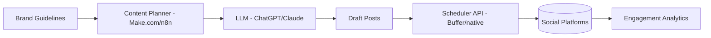

# Idea: AI-Powered Social Media Management Service

**Incubator stage:** 3–10 (market validation, not yet scored). One of five options evaluated in parallel — see [`Ideas/README.md`](../README.md).

## Table of Contents

- [Summary](#summary)
- [Business Model & Pricing](#business-model--pricing)
- [Target Customer](#target-customer)
- [Technical Architecture](#technical-architecture)
- [Implementation Plan](#implementation-plan)
- [Costs & Revenue](#costs--revenue)
- [Risks](#risks)
- [Legal & Compliance](#legal--compliance)
- [MVP Feature List](#mvp-feature-list)
- [Go / No-Go Read](#go--no-go-read)
- [Sources](#sources)

## Summary

Managed social-media content generation and scheduling for small businesses — AI drafts posts per brand voice, a workflow schedules and publishes them across platforms. Client pays a monthly retainer instead of hiring in-house or a traditional agency.

## Business Model & Pricing

Real 2026 pricing benchmarks, not the flat $300–1,000 range in the original draft:

- **AI-native tools** (the productized-software end): $27–$199/month — e.g. Picmim at $29–99/month ([source](https://apaya.com/blog/ai-social-media-management-costs)).
- **Freelancer packages**: $300–$1,500/month for small-business scope ([source](https://boomp.net/blog/freelance-social-media-manager-charge-cost)).
- **Agency retainers**: Basic $1,000–1,500/mo (8–12 posts, 2 platforms), Mid-tier $1,500–2,500/mo, Premium $2,500–5,000/mo (daily posting, ad management) ([source](https://sproutsocial.com/insights/social-media-management-cost/)).
- Setup/onboarding fees commonly $500–5,000 upfront; ad spend is separate from management fees.

**Read:** there's real room between a $29/mo self-serve AI tool and a $1,000+/mo agency retainer — an AI-run service at $300–600/mo, positioned as "agency quality, AI speed, fraction of the cost," has a defensible price point.

## Target Customer

Small businesses and solo entrepreneurs without in-house marketing — local shops, service businesses, visually-oriented industries (retail, wellness, food). Overlaps with the [`ventures/01-lead-engine/`](../../../01-lead-engine/) ICP (home-services/local businesses), which is worth noting as a potential cross-sell rather than a competing use of the same outreach effort.

## Technical Architecture

## Implementation Plan

Realistic MVP: 3–5 weeks (content generation workflow, scheduler integration, approval step, landing page). Faster to first revenue than the newsletter — client acquisition, not build time, is the bottleneck.

## Costs & Revenue

**Recurring costs:** ~$100–150/month (Make.com/n8n, scheduler tool, LLM API).

**Revenue math:** 10 clients at $400–600/mo = $4,000–6,000/mo — directly hits the stated goal. Realistic close rate for a solo operator with a portfolio/case study: 1–2 clients/month after initial outreach, so ~6–10 months to 10 clients is a defensible estimate, faster if leveraging warm local-business networks.

## Risks

- **Platform API restrictions are real and tightening, not a footnote.** TikTok's Content Posting API caps at 25 posts/account/day, requires manual app review (days to weeks), can't attach native sounds, and doesn't support duets/stitches via API ([source](https://zernio.com/blog/tiktok-posting-api)). Instagram allows automated *publishing* but explicitly prohibits automating engagement (likes/comments/follows), capped at 50–100 posts/day ([source](https://mixpost.app/blog/automate-instagram-posts-safely)). This constrains "autonomous posting" to publishing only — engagement still needs a human or the account risks penalties.
- Off-brand or bland AI content without real client-voice calibration.
- Client churn if results aren't visible — needs a reporting/analytics layer, not just posting.
- Crowded competitive space (many "AI-powered" agencies now exist).

## Legal & Compliance

Platform ToS compliance (official APIs only, no engagement automation). Image-generation commercial licensing if AI-generated visuals are used. Data privacy if handling client DMs/comments.

## MVP Feature List

- Content calendar + AI draft generation
- Client approval step (simple, e.g. shared doc or lightweight dashboard)
- Multi-platform scheduled publishing via official APIs
- Monthly performance report

## Go / No-Go Read

Fastest realistic path to the $4K–6K/mo range among the five options, with real market room below agency pricing and above self-serve tools. Main constraint isn't the AI/automation — it's client acquisition and the platform-API ceiling on what "autonomous" can actually mean here (publishing yes, engagement no).

## Sources

- [AI Social Media Management Cost 2026](https://apaya.com/blog/ai-social-media-management-costs)
- [Social Media Manager Cost 2026 — Freelance/Agency Rates](https://boomp.net/blog/freelance-social-media-manager-charge-cost)
- [Social Media Management Pricing for Businesses 2026 — Sprout Social](https://sproutsocial.com/insights/social-media-management-cost/)
- [TikTok Posting API: limits, OAuth, quick setup](https://zernio.com/blog/tiktok-posting-api)
- [How to Automate Instagram Posts Safely in 2026](https://mixpost.app/blog/automate-instagram-posts-safely)
