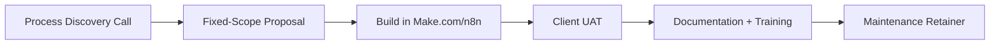

# Idea: Productized Automation-as-a-Service

**Incubator stage:** 3–10 (market validation, not yet scored). One of five options evaluated in parallel — see [`Ideas/README.md`](../README.md). **Not part of the original ChatGPT-drafted set** — added because it's the option that most directly matches "build fully autonomous systems" as the actual product, rather than as internal tooling behind a content/service business.

## Table of Contents

- [Summary](#summary)
- [Business Model & Pricing](#business-model--pricing)
- [Target Customer](#target-customer)
- [Technical Architecture](#technical-architecture)
- [Implementation Plan](#implementation-plan)
- [Costs & Revenue](#costs--revenue)
- [Risks](#risks)
- [Legal & Compliance](#legal--compliance)
- [MVP Feature List](#mvp-feature-list)
- [Go / No-Go Read](#go--no-go-read)
- [Sources](#sources)

## Summary

Instead of using Make.com/n8n as internal plumbing behind a newsletter, social-media, or SEO service, **sell the automation systems themselves** — build and deploy done-for-you workflow automations for other small businesses (lead intake, reporting pipelines, CRM syncs, Zapier-to-n8n migrations), charge a build fee plus a maintenance retainer. The product *is* the autonomous system, which is the closest fit to the explicitly stated skill set (building fully autonomous systems), not an adjacent use of it.

## Business Model & Pricing

- **Productized packages**: fixed scope, fixed quote — "one trigger, a known set of nodes, a defined output" ([source](https://digital-identity-architects.com/blog/n8n-agency.html)). Price anchored to hours *saved* for the client, not hours spent building — e.g. an automation saving a front-desk team 8 hours/week is quoted against that value, not the afternoon it took to build.
- **Migration projects** (e.g. Zapier → n8n): $5,000–15,000 for ~2 weeks of work ([source](https://digital-identity-architects.com/blog/n8n-agency.html)).
- **Retainer maintenance**: $500+/month per client just for keeping integrations alive; a single automated reporting pipeline can be worth $1,500–3,000/month to an agency client already billing $50–200K/month ([source](https://digital-identity-architects.com/blog/n8n-agency.html)).
- Platform costs are genuinely low: Make.com Pro is $50/mo for 10,000 executions; n8n Core is $9/mo for 10,000 credits ([source](https://latenode.com/blog/n8n-vs-make-com-2025-complete-platform-comparison-pricing-analysis-for-workflow-automation)) — thin infrastructure overhead compared to the other four options.

## Target Customer

Two distinct lanes, worth treating separately rather than blending:
1. **Direct SMBs** with a specific, describable manual process (lead intake, reporting, data syncing) — smaller deals, faster sales cycle, good for early traction.
2. **Marketing/creative agencies** already running client work at scale who want automation built for them rather than building it themselves — larger deals, longer sales cycle, higher retainer value once landed (per the $1,500–3,000/mo pipeline example above).

## Technical Architecture

Varies per engagement by definition (that's the product), but the delivery pattern is consistent:

## Implementation Plan

No traditional "MVP build" phase in the way the other four options have one — the first engagement *is* the MVP. Realistic path: 1–2 weeks to build a portfolio piece (automate something real, even for free/discounted, to get a case study), then start outreach. Fastest path to a *first* dollar of the five options, since there's no product to build before selling — the product is bespoke by nature.

## Costs & Revenue

**Recurring costs:** ~$50–100/month (Make.com/n8n subscription, minimal hosting) — lowest infrastructure cost of the five options, since most compute runs on the platform itself rather than owned infrastructure.

**Revenue reality, grounded in research:**

- Documented case: **$25,000 MRR in 4 months** from an n8n-focused solo operator (self-reported Reddit case study — treat as an upper-bound anecdote, same caveat as the newsletter's $6,400/mo case) ([source](https://www.browseract.com/blog/best-high-income-case-analysis-how-to-achieve-25000-monthly-revenue-with-n8n)).
- More conservative, broader pattern: lean, specialized automation agencies reach **$10,000–50,000/month within 6–12 months**, contingent on consistent client acquisition ([source](https://learnforge.dev/blog/n8n-automation-agency/)).
- Two "Scale"-tier clients alone ($7,000–12,000/month combined) can cover a solo founder's full income target while leaving capacity for more ([source](https://digital-identity-architects.com/blog/n8n-agency.html)) — directly relevant to the stated $10K/month combined goal.

**Read:** of the five options, this has both the fastest path to *first* revenue (no product-build phase) and among the highest per-client revenue ceiling, because pricing anchors to client value (hours/cost saved) rather than a fixed subscription tier.

## Risks

- **Every engagement is custom** — doesn't compound the way a productized SaaS or content pipeline does; revenue scales with hours/attention more than the other options, partially undercutting the "autonomous" framing for the *business itself* (the deliverables are autonomous; the sales/delivery motion is not, unless deliberately templated per the productization advice above).
- Requires strong client-facing discovery skills, not just build skills — scoping badly leads to underpriced fixed-quote work.
- Client dependency risk if a maintenance retainer client churns and integrations break without ongoing support.
- Niching is explicitly recommended by the research (pick one industry/use-case) — resisting that and doing generic automation work for anyone dilutes the ability to productize and price on value.

## Legal & Compliance

Standard service-agreement/contract needs (scope, IP ownership of built automations, data handling if client data flows through the automation). No special regulatory exposure beyond what the underlying data touches (e.g. if automating something health- or finance-adjacent, that data's own compliance rules apply).

## MVP Feature List

Not applicable in the product sense — the "MVP" here is a documented portfolio piece plus a repeatable discovery-to-quote process:
- One well-documented automation build (portfolio case study)
- A fixed-scope proposal template
- A niche/vertical focus decided before outreach starts
- A maintenance-retainer contract template

## Go / No-Go Read

Strongest match to the explicitly stated goal ("utilize my skills in building fully autonomous systems") and the fastest realistic path to first revenue, with real case studies clustering in the $10K–25K/month range for focused solo operators within 4–12 months. Trade-off: revenue is more linear-with-effort than the other four options (less true "passive" autonomy in the business model itself, even though the deliverables are autonomous systems) — worth weighing directly against [`ai-seo-content-agency`](../ai-seo-content-agency/MarketResearch.md) in scoring, since that option offers better revenue-to-effort scaling over time.

## Sources

- [n8n Agency: Pricing, Niching & Delivery That Works](https://digital-identity-architects.com/blog/n8n-agency.html)
- [N8N vs Make.com 2025: Complete Platform Comparison + Pricing](https://latenode.com/blog/n8n-vs-make-com-2025-complete-platform-comparison-pricing-analysis-for-workflow-automation)
- [How I Achieved $25,000 Monthly Revenue with n8n](https://www.browseract.com/blog/best-high-income-case-analysis-how-to-achieve-25000-monthly-revenue-with-n8n)
- [How to Start an Automation Agency with n8n in 2026](https://learnforge.dev/blog/n8n-automation-agency/)
