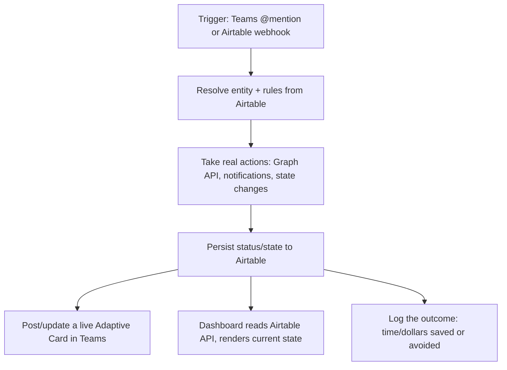
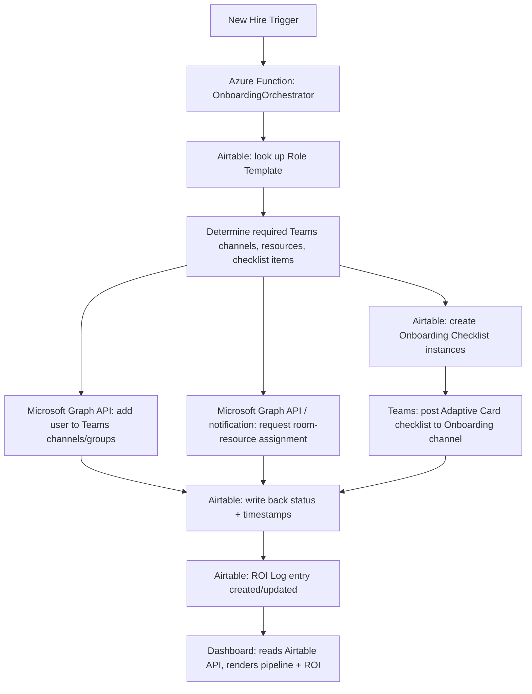
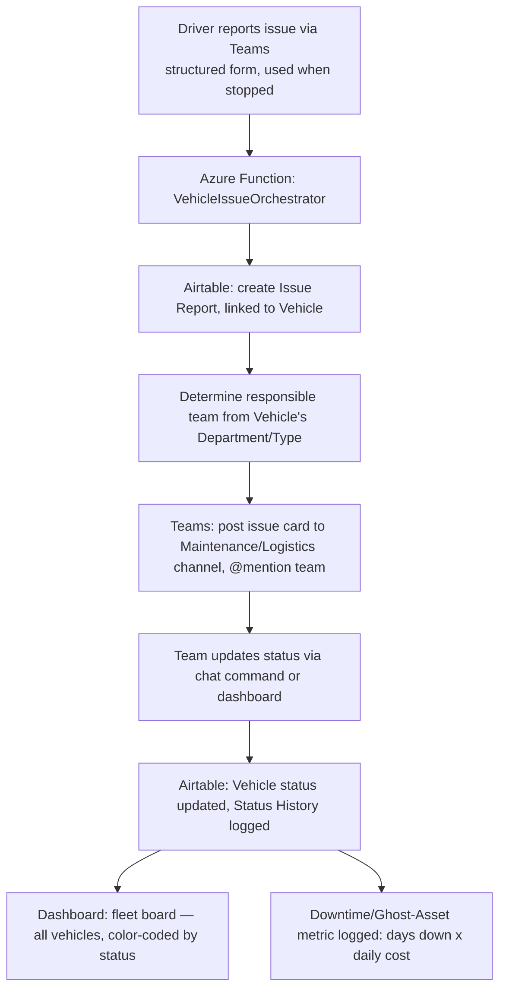

# Automation Studio — Technical Architecture

How the platform works, end to end — the reusable pattern first, then each module's specifics.

## Table of Contents

- [Platform Pattern](#platform-pattern)
- [Module 1: New-Hire Onboarding & Provisioning](#module-1-new-hire-onboarding--provisioning)
- [Module 2: Vehicle/Asset Issue & Status Tracking](#module-2-vehicleasset-issue--status-tracking)
- [Tech Stack](#tech-stack)
- [Build vs. Client-Deployment Differences](#build-vs-client-deployment-differences)

## Platform Pattern

Every module in this venture is an instance of the same underlying pattern, not a one-off build. Naming this explicitly is what makes "modular orchestration platform" a real architectural claim rather than just marketing language:

**The five pieces every module needs:**
1. **An entity with a status state machine** (a New Hire moving Not Started → In Progress → Complete; a Vehicle moving Reported → Diagnosing → In Repair → Ready)
2. **A trigger** — Teams @mention (conversational) or an Airtable webhook (structured), both converging on the same orchestration logic
3. **Rule resolution** — a lookup table that determines what actions a given entity needs (a Role Template's requirements; a Vehicle's assigned team/department)
4. **Real actions**, not just notifications — Graph API calls, state changes, routing to the right person/team
5. **A quantified outcome metric** — every module needs its own version of the ROI Log, because the dashboard/pitch depends on a real number, not an assertion

New modules should be built by asking "what's the entity, what's the state machine, what's the trigger, what's the dollar metric" — not by starting from scratch.

## Module 1: New-Hire Onboarding & Provisioning

**Status: MVP scaffold built** — see [`../src/README.md`](../src/README.md) for what's real vs. stubbed.

**Trigger:** an Airtable Automation webhook (new `New Hires` record) or a Teams `@mention` (`@OnboardBot new hire: ...`) — both call the same orchestrator.

**Flow:** look up the Role Template → resolve required Teams channels/resources/checklist items → provision Teams access via Graph API → request resource assignment (a Teams notification, not a live booking-system call — most SMB prospects won't have a resource-booking API) → create checklist instances in Airtable → post the live Adaptive Card checklist → write back status/timestamps → create the ROI Log entry (time/dollars saved, computed via Airtable formula fields).

Full detail: [`database/AIRTABLE_SCHEMA.md`](../database/AIRTABLE_SCHEMA.md), [`../src/README.md`](../src/README.md).

## Module 2: Vehicle/Asset Issue & Status Tracking

**Status: designed, not yet coded.** Concept per Ryan's own description (2026-07-19), independently designed — not derived from any employer codebase, see [`PROJECT_CONTEXT.md § IP boundary`](../PROJECT_CONTEXT.md).

**Trigger:** a driver/operator submits a structured Teams form when stopped (not open-ended chat while driving — see [`research/MARKET_RESEARCH.md § Logistics/Fleet Niche`](../research/MARKET_RESEARCH.md#logisticsfleet-niche) for why that distinction is a real safety consideration, not just a design preference) — vehicle ID, issue description, severity.

**Flow:**
1. Create an Issue Report in Airtable, linked to the Vehicle/Asset record
2. Resolve the responsible team from the vehicle's department/type (same "rule resolution" step as module 1's Role Template lookup)
3. Post the issue to the Maintenance/Logistics Teams channel, @mentioning the right person
4. The team progresses the vehicle through status stages — a state machine, not a single flag: `Reported → Diagnosing → Awaiting Parts → In Repair → Ready for Service` — updatable via chat command (`@FleetBot vehicle 214 status: in repair`) or the dashboard
5. Every status change is logged to a Status History table (timestamp + who/what changed it) — this is what makes Mean Time To Repair and downtime-cost calculations possible later, not just a nice-to-have audit trail
6. The dashboard renders a **fleet board**: all vehicles, color-coded by current status, matching the large-screen visualization real asset managers already use — this is the demo's visual centerpiece, more than any single chat interaction
7. Downtime cost accrues automatically per day a vehicle sits outside "Ready" status, using the quantified figures from [`research/MARKET_RESEARCH.md`](../research/MARKET_RESEARCH.md#logisticsfleet-niche) ($448–1,200+/day) — this is module 2's equivalent of module 1's ROI Log

**Deferred from this module:** GPS/telematics-based route and load-pricing optimization — real capability, but depends on client-provided tracking hardware and third-party API integration (Samsara/Motive/Geotab). Build once module 2's core pattern is proven, not before.

**Schema note:** not yet written up as its own `database/AIRTABLE_SCHEMA.md` section — needs a `Vehicles/Assets` table, an `Issue Reports` table, and a `Status History` table, following the same design discipline as module 1's schema (every table that matters for the pitch needs a time/dollar dimension).

## Tech Stack

- **Azure Functions** (TypeScript/Node.js) — shared across all modules
- **Teams AI Library** — bot registration, @mention parsing, Adaptive Card rendering/updates
- **Microsoft Graph API** — Teams channel/group membership changes (module 1); notification routing (both modules)
- **Airtable REST API** — the data layer for both modules today; architected to generalize to other backends later (see [`PROJECT_CONTEXT.md`](../PROJECT_CONTEXT.md))
- **Dashboard:** React/Next.js reading the Airtable API directly — one dashboard app, multiple views (onboarding pipeline, fleet board), not a separate app per module

## Build vs. Client-Deployment Differences

Unchanged principle across modules: build and demo on sample data with no real Azure/Teams tenant beyond a personal dev tenant. A real client deployment needs a Teams app registration in the client's tenant, Graph API permissions from their IT admin, and either their Airtable base or an adapter to their existing system. None of this blocks building demos now.
