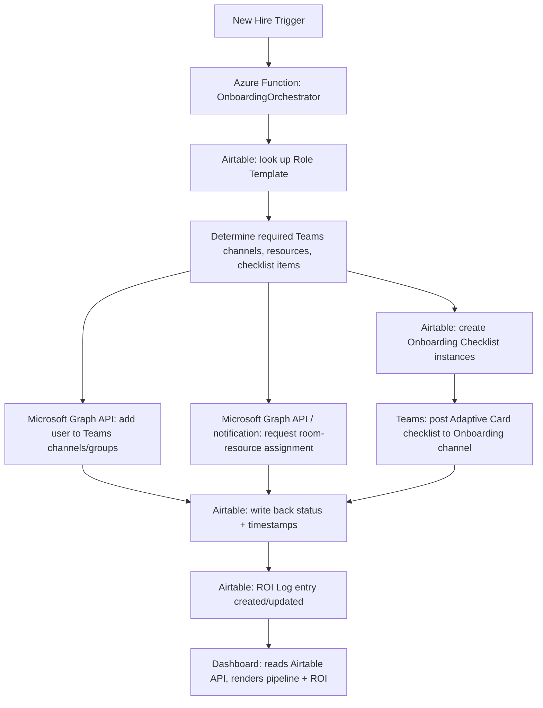

# Onboarding Agent — Technical Architecture

How the demo (and eventually a real client deployment) actually works, end to end.

## Table of Contents

- [System Diagram](#system-diagram)
- [Trigger](#trigger)
- [Agent Flow](#agent-flow)
- [Adaptive Card Checklist](#adaptive-card-checklist)
- [Dashboard Tie-In](#dashboard-tie-in)
- [Tech Stack](#tech-stack)
- [Build vs. Client-Deployment Differences](#build-vs-client-deployment-differences)

## System Diagram

## Trigger

Two entry points, both valid for the demo — build the Airtable-webhook path first since it requires no live Teams app registration to demo:

1. **Airtable automation → webhook:** a new record in the `New Hires` table (see [`database/AIRTABLE_SCHEMA.md`](../database/AIRTABLE_SCHEMA.md)) fires an Airtable Automation that POSTs to the Azure Function's HTTP trigger.
2. **Teams @mention:** `@OnboardBot new hire: [Name], [Role], [Department], starts [Date]` — parsed by the Teams AI Library bot, which then calls the same orchestration logic. This is the more impressive live-demo path once the Teams app registration is set up, since it shows the conversational entry point directly.

Both paths converge on the same orchestrator function — the trigger source shouldn't change the core logic.

## Agent Flow

1. **Look up Role Template** in Airtable for the new hire's `Role` field
2. **Resolve requirements**: required Teams channels/groups, required rooms/resources, required checklist items — all linked records off the Role Template
3. **Provision Teams access** via Microsoft Graph API (`POST /teams/{team-id}/channels/{channel-id}/members` or group membership updates, depending on whether it's a channel or security group)
4. **Request resource assignment** — for the demo, this can be a Teams notification to a "Facilities" channel rather than a live booking-system integration (most SMB prospects won't have a resource-booking API to integrate with; the notification-with-checklist-tracking is the realistic MVP)
5. **Create Onboarding Checklist instances** in Airtable — one row per required checklist item, status `Pending`
6. **Post the Adaptive Card checklist** (see below) to a designated Teams "Onboarding" channel, @mentioning the manager and IT
7. **Write back status** to Airtable as each step completes — `Bot Started At` / `Bot Completed At` on the New Hires record
8. **Create the ROI Log entry** — pulls the role's baseline manual time and the actual bot completion time, computes time/dollars saved automatically via the schema's formula fields

## Adaptive Card Checklist

The live artifact a prospect sees during a demo — a Teams [Adaptive Card](https://adaptivecards.io/) posted to the Onboarding channel, showing:

- New hire name, role, department, start date
- Live checklist (auto-completed items shown checked with a "🤖 Bot" tag, human-owned items shown unchecked with an @mention to whoever owns them)
- A running "time saved so far" counter, computed from the ROI Log

This card should update in place (via Bot Framework's `updateActivity`) as steps complete, rather than posting a new message each time — a live, visibly-updating checklist is a much stronger demo moment than a static list.

## Dashboard Tie-In

Separate from the Teams bot — a web dashboard (Claude Code's build responsibility, see [`PROJECT_CONTEXT.md`](../PROJECT_CONTEXT.md)) reading directly from the Airtable REST API:

- **Pipeline view:** all New Hires currently in progress, with live `Onboarding Progress %`
- **ROI summary:** total hours saved, total $ saved, average time-per-hire before vs. after, pulled from the ROI Log table
- **Per-hire timeline:** audit trail of what the bot did and when, for a specific New Hire record

This is the artifact that turns "a bot posted some messages" into a boardroom-presentable ROI case — the dashboard is arguably as important to the sale as the bot itself.

## Tech Stack

- **Azure Functions** (TypeScript/Node.js) — the orchestration layer; default choice given Teams AI Library's strong JS/TS support and to share language/tooling with the dashboard frontend. Swap to C#/.NET or Python if preferred — the architecture doesn't depend on the language choice.
- **Teams AI Library** — bot registration, @mention parsing, Adaptive Card rendering/updates
- **Microsoft Graph API** — Teams channel/group membership changes
- **Airtable REST API** — all data reads/writes (Role Templates, New Hires, Checklist instances, ROI Log)
- **Dashboard:** React/Next.js reading the Airtable API directly (read-only for the demo; no separate backend needed at this stage)

## Build vs. Client-Deployment Differences

The demo can run entirely on sample data with no real Azure/Teams tenant beyond a personal dev tenant. A real client deployment would need:

- A Teams app registration in the client's own tenant (client-side approval required)
- Appropriate Graph API permissions granted by the client's IT admin (this is itself part of the sales conversation — see [`research/MARKET_RESEARCH.md § Open Questions`](../research/MARKET_RESEARCH.md#open-questions))
- The client's own Airtable base (or their existing system, if not Airtable — see [`PROJECT_CONTEXT.md`](../PROJECT_CONTEXT.md) on generalizing beyond Airtable later)

None of this blocks building the demo now — it's a build-with-sample-data-first, sell-then-adapt-to-the-client's-real-environment approach.
