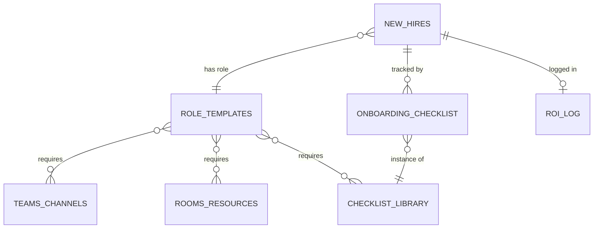

# Onboarding Demo — Airtable Schema

The single demo base backing the new-hire onboarding agent — see [`ventures/02-automation-studio/DECISIONS.md § Build one demo, targeting one niche`](../DECISIONS.md#build-one-demo-targeting-one-niche--not-multiple-airtable-bases-across-business-types) for why this is the only base being built right now.

**Base name suggestion:** `Onboarding Agent Demo — [Prospect Company Name]` — clone this base per prospect during sales conversations rather than maintaining one shared demo, so each pitch can use the prospect's own department/role names.

## Table of Contents

- [Design Principles](#design-principles)
- [Table: New Hires](#table-new-hires)
- [Table: Role Templates](#table-role-templates)
- [Table: Teams Channels & Groups](#table-teams-channels--groups)
- [Table: Rooms & Resources](#table-rooms--resources)
- [Table: Checklist Items Library](#table-checklist-items-library)
- [Table: Onboarding Checklist (Instances)](#table-onboarding-checklist-instances)
- [Table: ROI Log](#table-roi-log)
- [Entity Relationships](#entity-relationships)

## Design Principles

- **Role Templates drive everything.** Assign a New Hire a Role, and the correct Teams channels, resources, and checklist items should follow automatically — this is what the agent actually automates, and the schema needs to make that lookup trivial.
- **Every table that matters for the pitch has a time/dollar dimension.** The ROI Log table exists specifically to make the before/after comparison undeniable in a live demo, not just asserted in a slide.
- **Keep it demoable, not maximal.** This is enough structure to be a credible mid-size-company onboarding system, not a fully generalized HR platform — resist the urge to add fields nobody will look at in a 15-minute demo.

## Table: New Hires

The core table — one row per person being onboarded.

| Field | Type | Notes |
|---|---|---|
| Full Name | Single line text | Primary field |
| Email | Email | |
| Start Date | Date | |
| Department | Single select | e.g. Engineering, Sales, Marketing, Support |
| Role | Link to Role Templates | Drives auto-assignment |
| Manager Name | Single line text | |
| Manager Email | Email | |
| Status | Single select | Not Started / In Progress / Complete |
| Onboarding Progress % | Rollup | % of linked Onboarding Checklist items marked Complete |
| Teams Groups Assigned | Link to Teams Channels & Groups | Multiple; populated by the agent, not manually |
| Resources Assigned | Link to Rooms & Resources | Multiple; populated by the agent |
| Bot Started At | Date (with time) | Set when the agent begins processing this hire |
| Bot Completed At | Date (with time) | Set when all automated steps finish |
| Time To Complete (min) | Formula | `DATETIME_DIFF({Bot Completed At}, {Bot Started At}, 'minutes')` |

## Table: Role Templates

Defines what a given role needs — this is the lookup table the agent queries first.

| Field | Type | Notes |
|---|---|---|
| Role Name | Single line text | Primary field, e.g. "Software Engineer," "Sales Rep" |
| Department | Single select | |
| Required Teams Channels | Link to Teams Channels & Groups | Multiple |
| Required Resources | Link to Rooms & Resources | Multiple |
| Standard Checklist Items | Link to Checklist Items Library | Multiple |
| Typical Manual Onboarding Time (min) | Number | The baseline this role normally takes an admin manually — this is the number the ROI story is built on |

## Table: Teams Channels & Groups

| Field | Type | Notes |
|---|---|---|
| Channel/Group Name | Single line text | Primary field |
| Team | Single line text | Which Teams team this channel belongs to |
| Type | Single select | Channel / Security Group / Distribution List |
| Used By Roles | Link to Role Templates | Reverse link, auto-populated |

## Table: Rooms & Resources

| Field | Type | Notes |
|---|---|---|
| Resource Name | Single line text | Primary field |
| Type | Single select | Desk / Meeting Room / Software License / Equipment |
| Department | Single select | |
| Notes | Long text | Capacity, location, license seat count, etc. |
| Used By Roles | Link to Role Templates | Reverse link, auto-populated |

## Table: Checklist Items Library

Reusable checklist item definitions, referenced per role.

| Field | Type | Notes |
|---|---|---|
| Item Name | Single line text | Primary field, e.g. "Create Exchange mailbox," "Assign parking spot" |
| Category | Single select | IT / Facilities / HR / Manager |
| Owner | Single select | Bot-Automated / IT Staff / Facilities / Manager — what a live demo should highlight: how many items move from a human owner to "Bot-Automated" |
| Standard Manual Time (min) | Number | Baseline time this item takes a human, feeds the ROI Log |

## Table: Onboarding Checklist (Instances)

The junction table — one row per (New Hire × Checklist Item), tracking actual completion.

| Field | Type | Notes |
|---|---|---|
| New Hire | Link to New Hires | |
| Checklist Item | Link to Checklist Items Library | |
| Status | Single select | Pending / In Progress / Complete |
| Completed By | Single select | Bot / Human |
| Completed At | Date (with time) | |

This is what the live Teams checklist card (see [`architecture/TECHNICAL_ARCHITECTURE.md § Adaptive Card Checklist`](../architecture/TECHNICAL_ARCHITECTURE.md#adaptive-card-checklist)) reads from and writes back to in real time.

## Table: ROI Log

The table that makes the sales pitch concrete — one row per completed onboarding.

| Field | Type | Notes |
|---|---|---|
| Date | Date | |
| New Hire | Link to New Hires | |
| Manual Baseline Time (min) | Lookup | From the hire's Role Template |
| Actual Bot Time (min) | Lookup | From New Hires § Time To Complete |
| Time Saved (min) | Formula | `{Manual Baseline Time (min)} - {Actual Bot Time (min)}` |
| Estimated $ Saved | Formula | `({Time Saved (min)} / 60) * 65` — $65/hr blended IT+HR rate, adjustable per prospect's actual loaded labor cost |
| Notes | Long text | |

## Entity Relationships

